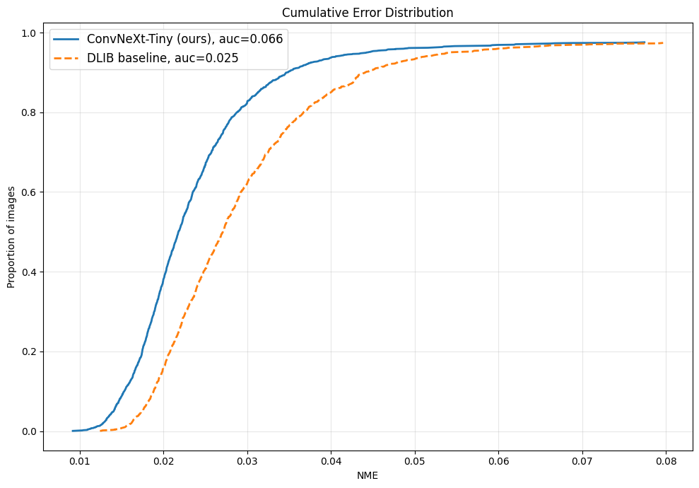
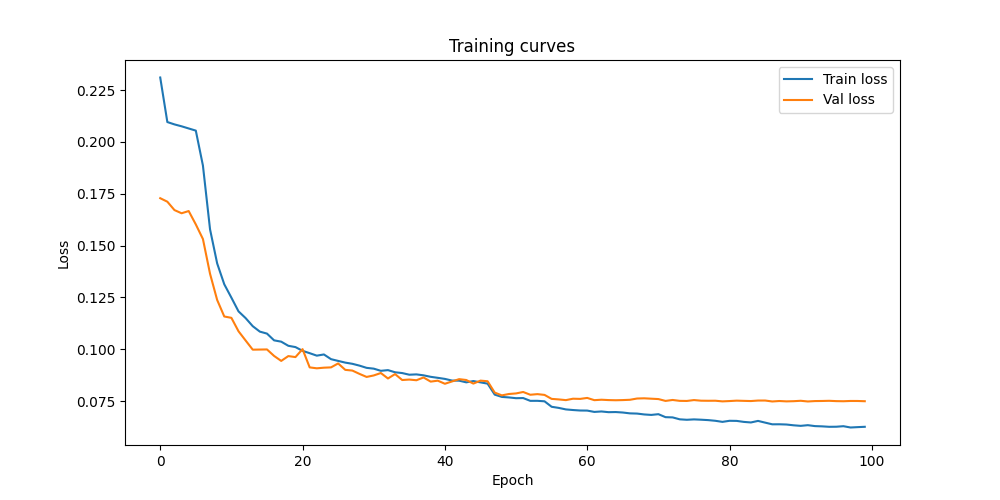

# <div align="center">Facial Landmark Detection</div>

<div align="center">
  Detection of 68 facial landmarks using ConvNeXt-Tiny backbone trained on 300W and Menpo datasets.
</div>

---

<div align="center">
  
</div>

---

## Results

### Cumulative Error Distribution

<p align="center">
  
</p>

Our model (AUC=0.066) significantly outperforms the DLIB baseline (AUC=0.025).

### Quantitative comparison

| Model | Backbone | Input | Mean NME ↓ | AUC ↑ |
|---|---|---|---|---|
| **Ours** | ConvNeXt-Tiny | 112×112 | **0.0487** | **0.066** |
| DLIB baseline | HOG + SVM | — | 0.0597 | 0.025 |

> Our model outperforms the DLIB baseline by **18%** on Mean NME.

### Training curves

<p align="center">
  
</p>

### Experiments

| Backbone | Input | Epochs | Val Loss | Mean NME |
|---|---|---|---|---|
| **ConvNeXt-Tiny** | **112×112** | **100** | **0.0748** | **0.0487** |
| ConvNeXt-Tiny | 224×224 | 40 | 0.0835 | 0.0535 |
| MobileNetV3-Small | 112×112 | 40 | 0.0935 | 0.0636 |

---

## Architecture

- **Backbone:** ConvNeXt-Tiny pretrained on ImageNet via [timm](https://github.com/huggingface/pytorch-image-models)
- **Head:** Linear layer → 136 outputs (68 landmarks × 2 coordinates)
- **Loss:** Wing Loss tuned for normalized coordinates
- **Input:** 112×112 RGB face crops

```
Input Image → DLIB Face Detector → Face Crop → ConvNeXt-Tiny → Linear Head → 68 Landmarks
```

---

## Installation

```bash
git clone https://github.com/henterm/facial_keypoint_detection.git
cd facial_keypoint_detection
pip install -r requirements.txt
```

You also need to install [PyTorch](https://pytorch.org/get-started/locally/) and [DLIB](https://github.com/davisking/dlib).

---

## Dataset preparation

Download [300W](https://ibug.doc.ic.ac.uk/resources/300-W/) and [Menpo](https://ibug.doc.ic.ac.uk/resources/2nd-facial-landmark-tracking-competition-menpo-ben/) datasets.

The script below handles face detection via DLIB, crops faces with 30% margin, normalizes landmark coordinates to [0, 1], and saves results as `.npy` files:

```bash
python data/prepare_dataset.py \
    --data_path /path/to/datasets \
    --output_dir processed/
```

---

## Training

Edit `configs/config.yaml`:

```yaml
model:
  backbone: convnext_tiny
  num_landmarks: 68
  pretrained: true

train:
  epochs: 100
  batch_size: 32
  lr: 0.0003
  weight_decay: 0.00001
  grad_clip: 1.0
```

Then run:

```bash
python train.py
```

Pretrained weights: *coming soon*

---

## Inference

```bash
python inference.py \
    --image_path path/to/image.jpg \
    --weights path/to/best_model.pth \
    --backbone convnext_tiny \
    --output_path result.png
```

---

## CED calculation

```bash
python calculate_ced.py \
    --gt_path path/to/gt_pts \
    --pred_path path/to/predicted_pts \
    --output_path pics/ced_menpo.png \
    --error_thr 0.08
```

---

## Project structure

```
facial_keypoint_detection/
├── data/
│   ├── augmentations.py      # Train/val augmentation pipelines
│   ├── dataset.py            # PyTorch Dataset class
│   └── prepare_dataset.py    # Preprocessing with DLIB face detection
├── models/
│   └── model.py              # LandmarkModel (timm backbone + linear head)
├── utils/
│   ├── losses.py             # Wing Loss, Adaptive Wing Loss
│   └── metrics.py            # NME, AUC, CED
├── configs/
│   └── config.yaml
├── pics/                     # demo.gif, CED plots, loss curves
├── train.py
├── inference.py
├── calculate_ced.py
└── requirements.txt
```

---

## References

- [PFLD: A Practical Facial Landmark Detector](https://arxiv.org/pdf/1902.10859.pdf)
- [Wing Loss for Robust Facial Landmark Localisation](https://arxiv.org/abs/1711.06753)
- [timm: PyTorch Image Models](https://github.com/huggingface/pytorch-image-models)
- [300W Dataset](https://ibug.doc.ic.ac.uk/resources/300-W/)
- [Menpo Dataset](https://ibug.doc.ic.ac.uk/resources/2nd-facial-landmark-tracking-competition-menpo-ben/)